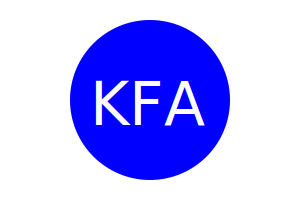

# Object-Oriented Programming: SVG Logo Maker

# Table of Contents
* [Description](#description)
* [User Story](#user-story)
* [Acceptance Criteria](#acceptance-criteria)
* [Installation & Usage](#installation-and-usage)
* [Mock-Up](#mock-up)
* [Contributions](#contributions)
* [Questions](#questions)
* [License](#license)

## Description

The task is to build a Node.js command-line application that takes in user input to generate a logo and save it as an [SVG file](https://en.wikipedia.org/wiki/Scalable_Vector_Graphics). The application prompts the user to select a color and shape, provide text for the logo, and save the generated SVG to a `.svg` file.

## User Story

```md
AS a freelance web developer
I WANT to generate a simple logo for my projects
SO THAT I don't have to pay a graphic designer
```

## Acceptance Criteria

```md
GIVEN a command-line application that accepts user input
WHEN I am prompted for text
THEN I can enter up to three characters
WHEN I am prompted for the text color
THEN I can enter a color keyword (OR a hexadecimal number)
WHEN I am prompted for a shape
THEN I am presented with a list of shapes to choose from: circle, triangle, and square
WHEN I am prompted for the shape's color
THEN I can enter a color keyword (OR a hexadecimal number)
WHEN I have entered input for all the prompts
THEN an SVG file is created named `logo.svg`
AND the output text "Generated logo.svg" is printed in the command line
WHEN I open the `logo.svg` file in a browser
THEN I am shown a 300x200 pixel image that matches the criteria I entered
```

## Installation And Usage

The application uses [Jest](https://www.npmjs.com/package/jest) for running the unit tests and [Inquirer](https://www.npmjs.com/package/inquirer/v/8.2.4) for collecting input from the user. The application will be invoked by using the following commands:

```
npm init -y
```

```
npm i inquirer@8.2.4
```

```bash
node index.js
```

Directory Structure:

```md
.  
├── examples/           // Example svg file(s) created with the app
├── lib/                // Folder for classes or functions
    ├── shapes.js       // Exports `Triangle`, `Circle`, and `Square` classes
    ├── shapes.test.js  // Jest tests for shapes
    └── more...         // Additional files and tests
├── .gitignore          // Indicates which folders and files Git should ignore
├── index.js            // Runs the application using imports from lib/
├── package.json
└── README.md           // App description, link to video, setup and usage instructions           
```

> **Important**: Make sure to remove `dist` from the `.gitignore` file so that Git will track this folder and include it when you push up to your application's repository.
The application must include `Triangle`, `Circle`, and `Square` classes, as well as tests for each of these classes using Jest. While not a requirement, it is recommended to place any common functionality and properties shared by the `Triangle`, `Circle`, and `Square` classes in a parent `Shape` class and use inheritance to reuse the code in the child classes.

Each shape class should be tested for a `render()` method that returns a string for the corresponding SVG file with the given shape color.

The following example test should pass:

```js
const shape = new Triangle();
shape.setColor("blue");
expect(shape.render()).toEqual('<polygon points="150, 18 244, 182 56, 182" fill="blue" />');
```

## Mock-Up

The following image shows a mock-up of the generated SVG given the following input entered by the user: `KFA` for the text, `white` for the text color, `circle` from the list of shapes, and `blue` for the shape color. Note that this is just an image of the output SVG and not the SVG file itself:



URL of GitHub Repository: https://github.com/kaitlynatif/Logo_Generator

## Contributions
### Credits and Helpful SVG Resources Used to Create this Application

* [SVG Logo Generator Video Tutorial](https://youtu.be/GJYMcLus3v0)
    - This video tutorial assisted me in writing my shapes.test.js

* [NDM Web Docs](https://developer.mozilla.org/en-US/docs/Web/JavaScript/Reference/Statements/switch)
    - This tutorial assisted me in writing the Switch Statement I used in my index.js file

* [Example SVG](https://static.fullstack-bootcamp.com/fullstack-ground/module-10/circle.svg)

* [Scalable Vector Graphics (SVG)](https://en.wikipedia.org/wiki/Scalable_Vector_Graphics)

* [SVG tutorial](https://developer.mozilla.org/en-US/docs/Web/SVG/Tutorial)

* [Basic SVG shapes](https://developer.mozilla.org/en-US/docs/Web/SVG/Tutorial/Basic_Shapes)

* [Text in SVG](https://developer.mozilla.org/en-US/docs/Web/SVG/Tutorial/Texts)

* [SVG VS Code extension](https://marketplace.visualstudio.com/items?itemName=jock.svg)

## Questions

For any inquiries, please contact me at kaitlynatif90@hotmail.com

## License

MIT License

Copyright (c) [2023] [Kaitlyn Atif]

Permission is hereby granted, free of charge, to any person obtaining a copy of this software and associated documentation files (the "Software"), to deal in the Software without restriction, including without limitation the rights to use, copy, modify, merge, publish, distribute, sublicense, and/or sell copies of the Software, and to permit persons to whom the Software is furnished to do so, subject to the following conditions:

The above copyright notice and this permission notice shall be included in all copies or substantial portions of the Software.

THE SOFTWARE IS PROVIDED "AS IS", WITHOUT WARRANTY OF ANY KIND, EXPRESS OR IMPLIED, INCLUDING BUT NOT LIMITED TO THE WARRANTIES OF MERCHANTABILITY, FITNESS FOR A PARTICULAR PURPOSE AND NONINFRINGEMENT. IN NO EVENT SHALL THE AUTHORS OR COPYRIGHT HOLDERS BE LIABLE FOR ANY CLAIM, DAMAGES OR OTHER LIABILITY, WHETHER IN AN ACTION OF CONTRACT, TORT OR OTHERWISE, ARISING FROM, OUT OF OR IN CONNECTION WITH THE SOFTWARE OR THE USE OR OTHER DEALINGS IN THE SOFTWARE.